# Run an OSM Tile Server on a Windows Machine

[OpenStreetMap](https://www.openstreetmap.org) is well-named. The data
underlying the map, and the software stack for rendering it, are open-source
and readily available. The stack runs on Unix (Linux, MacOS), but you can
run on Windows as well, provided that you have a Linux virtual machine
(Docker Desktop) or native Linux environment (Windows Subsystem for Linux).

This isn't an either-or decision. Docker Desktop can be configured to use
Windows Subsystem for Linux (WSL) as its back end. That's how I run, and these
instructions are for my setup. You may want to set up differently.

# Before You Start

Following these instructions will require rebooting your machine. If you're
logged into it remotely, you will be disconnected. Fair warning!

# WSL

[WSL](https://en.wikipedia.org/wiki/Windows\_Subsystem\_for\_Linux) is a
compatibility layer for running Linux binary executables natively on Windows 10
and Windows Server 2019. I [installed WSL 2](https://docs.microsoft.com/en-us/windows/wsl/install-win10).

You'll need a [.wslconfig](https://www.bleepingcomputer.com/news/microsoft/windows-10-wsl2-now-allows-you-to-configure-global-options/) file in your
%UserProfile% folder, i.e. C:\users\<em>yourid</em>. Mine looks like this:

    [wsl2]
    memory=8GB   # Limits VM memory in WSL 2 to 8 GB
    processors=5 # Makes the WSL 2 VM use two virtual processors
    swap=0       # How much swap space to add to the WSL2 VM. 0 for no swap file.

 Without a MEMORY= setting in this file, the WSL VM will grab as much
memory as it needs and never release it, crippling system performance over time.

# Ubuntu

[Ubuntu](https://en.wikipedia.org/wiki/Ubuntu) is a Linux distribution based on
Debian and mostly composed of free and open software. I [installed Ubuntu20.04](https://www.microsoft.com/en-us/p/ubuntu-2004-lts/9n6svws3rx71?rtc=1&activetab=pivot:overviewtab) from the Windows Store. Other available distros include
Kali, Debian, and SUSE.

Ubuntu automounts your C drive as /mnt/c. You can manually mount other
drives, e.g. U, by typing **sudo mount -t drvfs U: /mnt/u**.

I like these add-on utilities:

* [dos2unix](https://www.howtoinstall.me/ubuntu/18-04/dos2unix/)
* [kompose](https://kompose.io/)
* [tree](https://askubuntu.com/questions/572093/how-to-install-tree-with-command-line)
* [kubectl autocompletion](https://kubernetes.io/docs/tasks/tools/install-kubectl/#enabling-shell-autocompletion)

# Windows Terminal

[Windows Terminal](https://en.wikipedia.org/wiki/Windows_Terminal) is a
multi-tabbed command-line front-end that Microsoft has developed for Windows 10.

[Install Windows Terminal](https://docs.microsoft.com/en-us/windows/terminal/get-started). Be sure to check out the [*settings.json*](https://docs.microsoft.com/en-us/windows/terminal/customize-settings/profile-settings) file. I like
`""copyOnSelect"": true`.

# Docker Desktop

Docker is a set of platform as a service (PaaS) products that use OS-level
virtualization to deliver software in packages called containers.

[Install Docker Desktop](https://hub.docker.com/editions/community/docker-ce-desktop-windows).

Configure Docker Desktop to use your distro with the WSL 2 back-end:

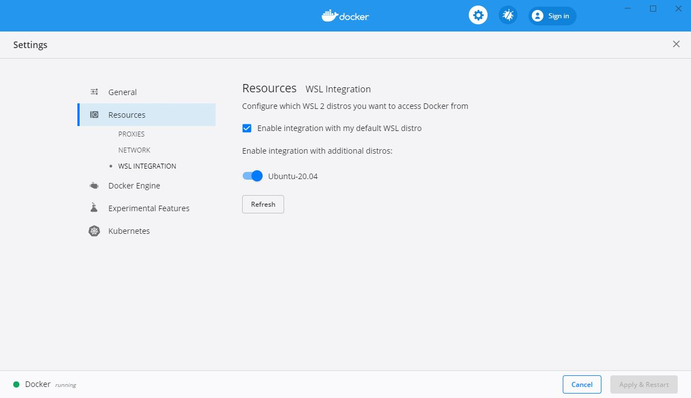

Ensure that Hyper-V is disabled. In the Windows search pane, type **Turn
Windows features on or off**. Deselect Hyper-V:

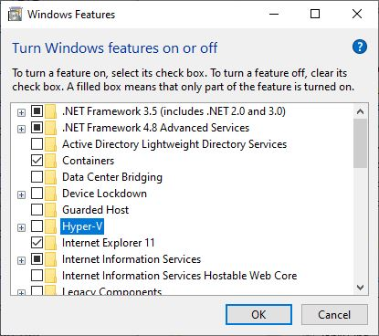

Once the install completes, run Docker Desktop and verify the integration
with your distro. Run Windows Terminal, selecting the Linux shell. (The
first time, you'll be prompted for a user id and password.) Type
**docker info**, like so:

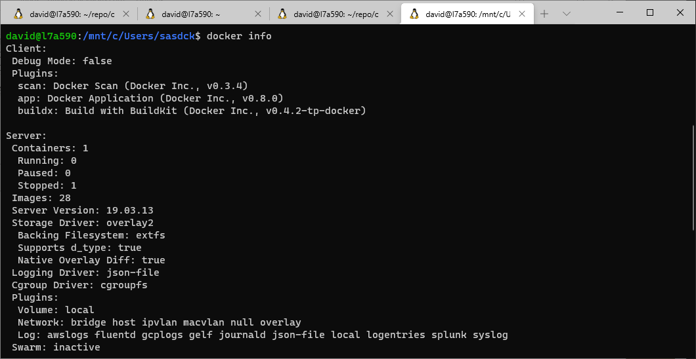

Docker is good to go!

# Visual Studio Code

[Visual Studio Code (VSCode)](https://en.wikipedia.org/wiki/Visual\_Studio\_Code) is a free source-code editor made by Microsoft for Windows, Linux and macOS.

[Install VSCode](https://code.visualstudio.com/docs/setup/windows).

Install these VSCode extensions:

* [Remote - WSL](https://marketplace.visualstudio.com/items?itemName=ms-vscode-remote.remote-wsl)
* [Docker](https://marketplace.visualstudio.com/items?itemName=ms-azuretools.vscode-docker)

# Git

[Install Git](https://www.digitalocean.com/community/tutorials/how-to-install-git-on-ubuntu-20-04), if need be. I don't remember if it is preinstalled on
Ubuntu.

I recommend this VSCode extension: [GitLens](https://marketplace.visualstudio.com/items?itemName=eamodio.gitlens).

# Docker Tile Server

At this point we have a sufficient software stack to run a tile server, once
we've downloaded it. In a Linux shell, type:

    **git clone https://github.com/davidwkelley/openstreetmap-tile-server.git**

 **cd** to directory *openstreetmap-tile-server*. Then launch VSCode by
typing **code .**. (That's "code .", just so you know.) The VSCode UI should
look like this:

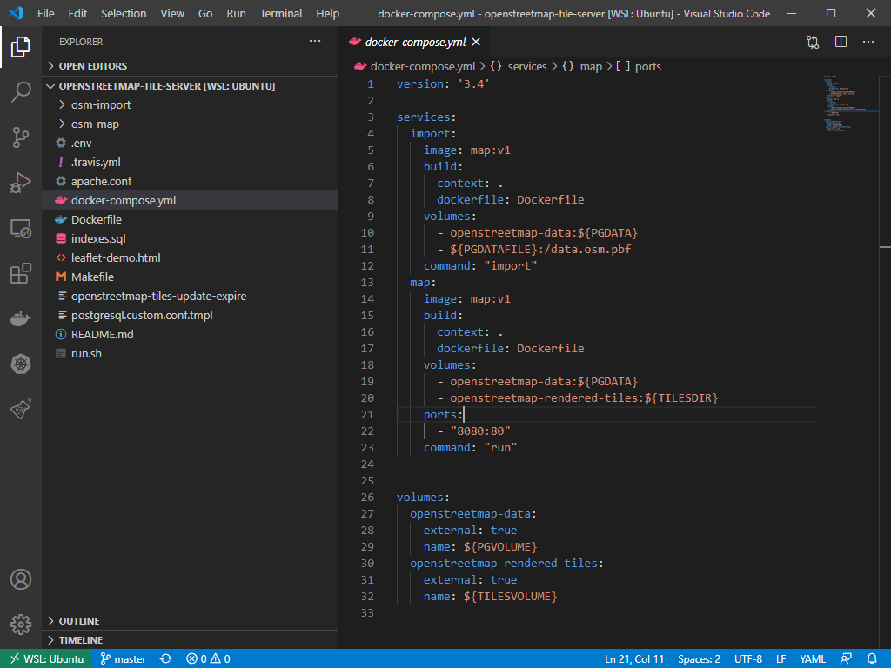

Take notice of the environment variables in *docker-compose.yml*:

* PGDATAFILE: Location of the OSM data extract to be imported; mount at */data.osm.pbf* in the Docker image
* PGDATA: PostgreSQL data directory to mount in the Docker image
* TILESDIR: Rendered tile directory to mount in the Docker image
* PGVOLUME: External volume containing PostgreSQL database
* TILESVOLUME: External volume containing rendered tiles

These variables are defined in *.env*, as seen here:

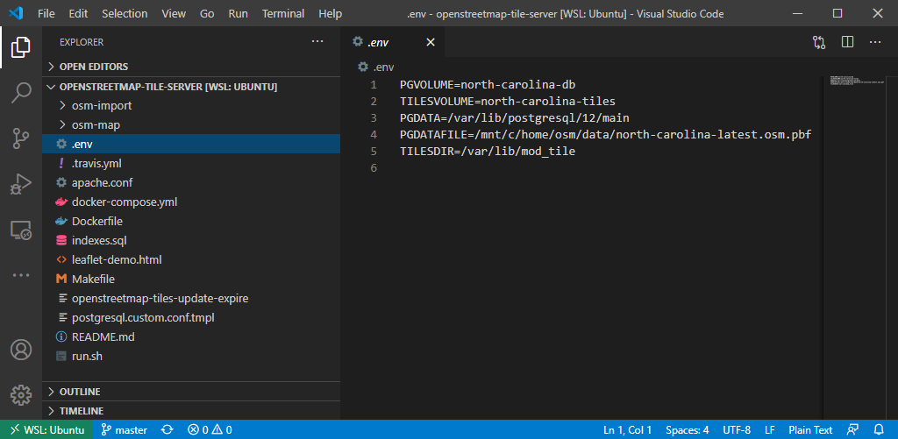

You don't need to modify PGDATA or TILESDIR. You *do* need to modify the
other variables, but not yet. First you need to build the Docker image, which
is named *map:v1* in *docker-compose.yml*. Get a Linux shell, either by
returning to Windows Terminal or selecting **Terminal &#x2192; New Terminal**
in VSCode.

In the shell, type **docker-compose build map**. Then go take a coffee break
while you wait for the build of *map:v1* to complete.

If the build succeeds, you will see ending terminal output similar to this:

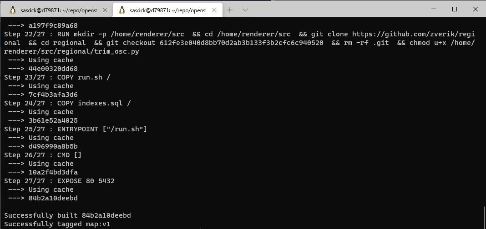

Confirm that Docker knows about *map:v1*. Type **docker image ls**, like
below:

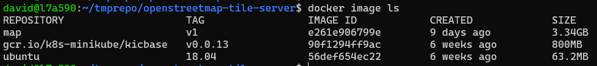

Eagle-eyed readers will notice that the *map:v1* image ID doesn't match in the
previous two screenshots.  That's because I'm taking screenshots of Docker
VMs running on two different machines.

So far, so good? Then it's time to import OSM data into the PostgreSQL
database. Download the desired extract in PBF format from
[Geofabrik](https://download.geofabrik.de/) or wherever you get your extracts.
Place the downloaded .pbf file somewhere on your C drive, say in
C:\home\osm\data.

Next, create a Docker external volume to contain the database. The name can be
anything. If you're importing North Carolina, then *north-carolina-db* makes
sense. For that you'd type **docker volume create north-carolina-db**. Confirm
the new volume with **docker volume ls**, as shown:

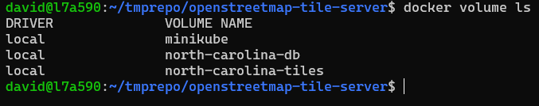

Next, edit PGDATAFILE and PGVOLUME in *.env*. Set PGDATAFILE to the C drive
location of the OSM data extract, e.g.
*/mnt/c/home/osm/data/north-carolina-latest.osm.pbf*. Set PGVOLUME to the
name of the external volume for the database, e.g. *north-carolina-db*.

To kick off the import, type **docker-compose up import**. Then take another
break while the import proceeds.

If the import succeeds, you will see ending terminal output similar to this:

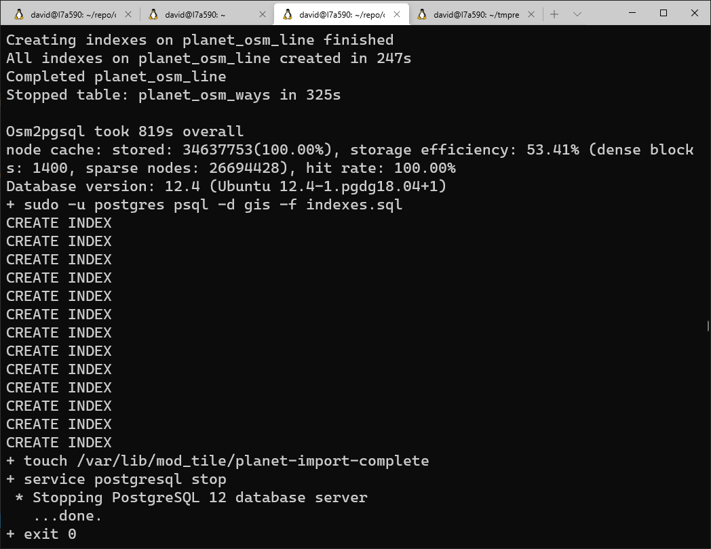

Now you're almost ready to render a map from the imported data. Before
you can do that though, you need to create an external volume to contain the
rendered tiles, e.g. *north-carolina-tiles*. Type **docker volume create
north-carolina-tiles**.  Then edit TILESVOLUME in *.env*; set it to the name of
the external volume you just created.

Finally it's time to render. Type **docker-compose up map**. Point your browser
at <http://localhost:8080>. You should see this:

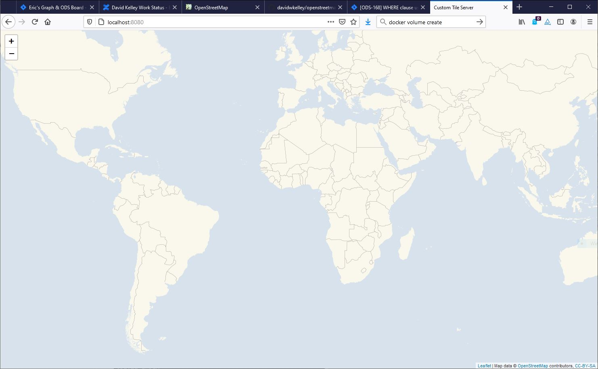

Pan to the geographic region you imported. Zoom in and out. Does the map work?

When you're done exploring, type **docker-compose down** to end map rendering.

# Kubernetes

Docker and Docker Compose are adequate to the task of running a tile server on
your Windows machine. Knowing what you know now, you can create and render your
own OSM maps.

But wouldn't it be cool to take it up another level and run a tile server in a
[Kubernetes (K8s)](https://en.wikipedia.org/wiki/Kubernetes) cluster? That was
my thought, and I set out to learn how to do it. Read on if you're interested.

# minikube

[minikube](https://minikube.sigs.k8s.io/docs/) implements a local Kubernetes
cluster on macOS, Linux, and Windows.  I run minikube on Ubuntu.

Get a Linux shell and install minikube:

    curl -LO https://storage.googleapis.com/minikube/releases/latest/minikube-linux-amd64
    sudo install minikube-linux-amd64 /usr/local/bin/minikube

 Start minikube by typing **minikube start --mount=true --mount-string="/mnt/c/home/osm/data:/mnt/data" --memory "6g"**, as seen below:

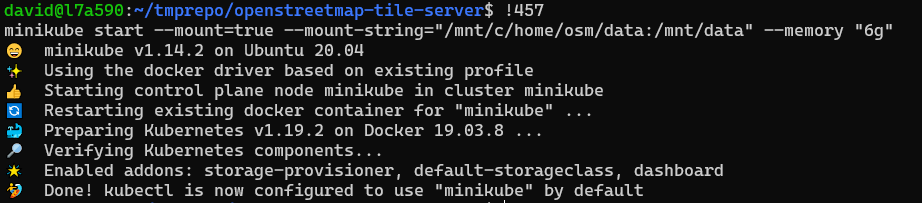

We learned when configuring the Docker tile server that we need a way to mount
a filesystem containing the .pbf file to be imported. The same is true for the
K8s tile server, and the way we do that is with the **--mount** and
**--mount-string** options. These options mount the C drive location into the
K8s VM at the specified mount point.

My K8s configuration expects that the .pbf file is named *data.osm.pbf*. If
you follow my instructions faithfully (not required, of course), then your
extract will reside at */mnt/c/home/osm/data/data.osm.pbf*.

By default minikube allocates 1G for the VM, which is woefully inadequate for
our needs. Increase the allocation to 6G with the **--memory** option.

K8s should be good to go now. You can confirm by typing **minikube status**:

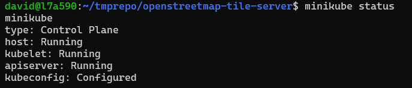

Next we need to push image *map:v1* into the K8s cluster. There are
several [methods for pushing images](https://minikube.sigs.k8s.io/docs/handbook/pushing/). I use the command **minikube cache add map:v1** because I already
have *map:v1* built, and it's simple and straightforward to copy it directly
into the cluster.

You can confirm the copy succeeded with **minikube cache list**:

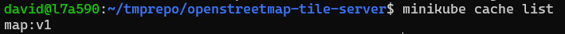

# Helm

[Helm](https://helm.sh/docs/) is the package manager for K8s. In my limited
experience, I've found it useful for managing the various .yaml configuration
files required by K8s. Like K8s, Helm is written in golang. Helm surfaces
and extends golang's templating feature.

Install Helm:

    curl https://baltocdn.com/helm/signing.asc | sudo apt-key add -
    sudo apt-get install apt-transport-https --yes
    echo "deb https://baltocdn.com/helm/stable/debian/ all main" | sudo tee /etc/apt/sources.list.d/helm-stable-debian.list
    sudo apt-get update
    sudo apt-get install helm

 Confirm that Helm installed correctly by typing **helm env**:

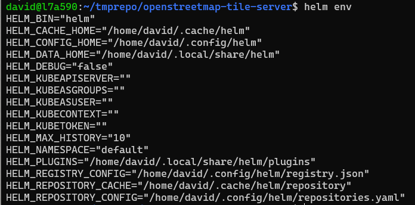

# K8s Tile Server

Whew, it's a lot of work to assemble the software stack for running a tile
server in K8s. What's the payoff? We're about to find out, because we're in
the home stretch of the exercise.

Return to VSCode, and navigate to the *osm-import* folder. This
is the [Helm chart](https://helm.sh/docs/topics/charts/) for the OSM import
job. View *templates/import-job.yaml*, like below:

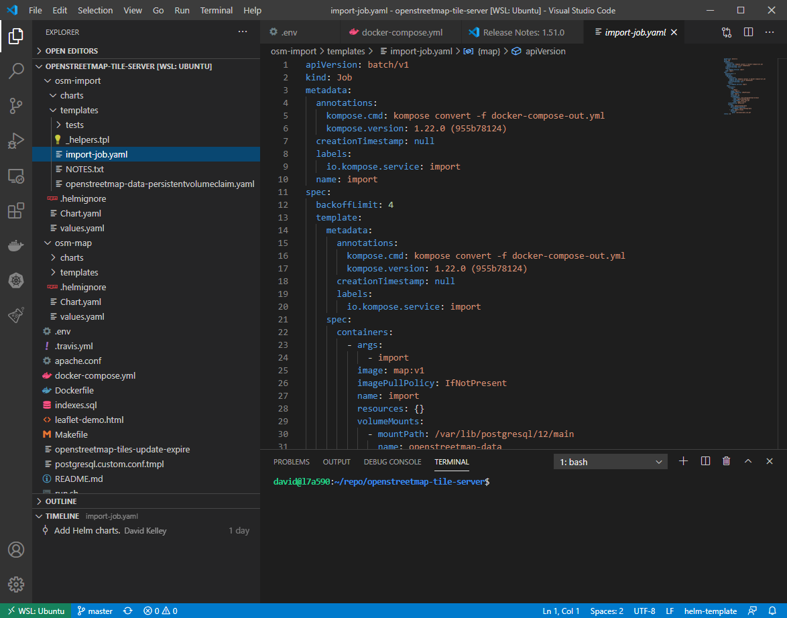

Importing data is a batch job. When it's done, the cluster should quiesce. For
that reason, *import-job.yaml* defines the *apiVersion* to be *batch/v1* and
the *kind* to be *Job*.

Let's run the job. In a Linux shell, type **helm install import ./osm-import**.
Away we go!

You have at least two ways to monitor progress of the job. One way is to get the
name of the associated pod with **kubectl get pods**, then type
**kubectl logs** *name*. This will give you the log details for the job.

If you want a broader overview of your K8s state, then fire up minikube's
handy dashboard by typing **minikube dashboard**, as shown:

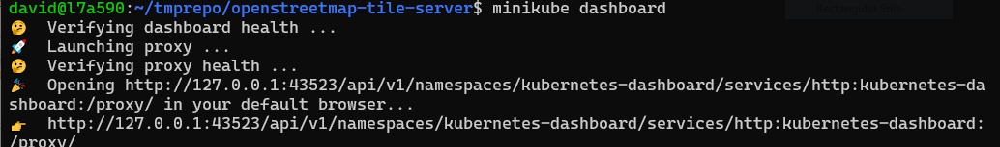

Browse to the dashboard URL, and you'll see a report that looks similar to
this:

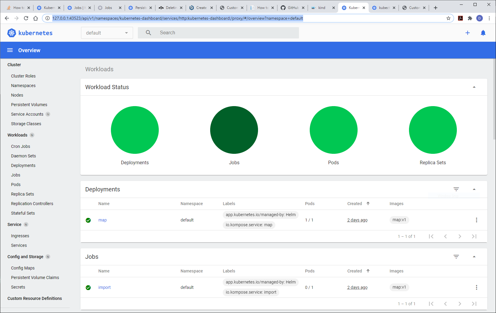

You can probably guess what the workload status colors mean, but if you'd
rather not, then I'll tell you:

* lighter green: running
* darker green: completed successfully
* red: error occurred

Once the import job completes, you can start rendering your map. Go back to
VSCode and navigate to the the Helm chart *osm-map*. View
*templates/map-deployment.yaml*, as shown below:

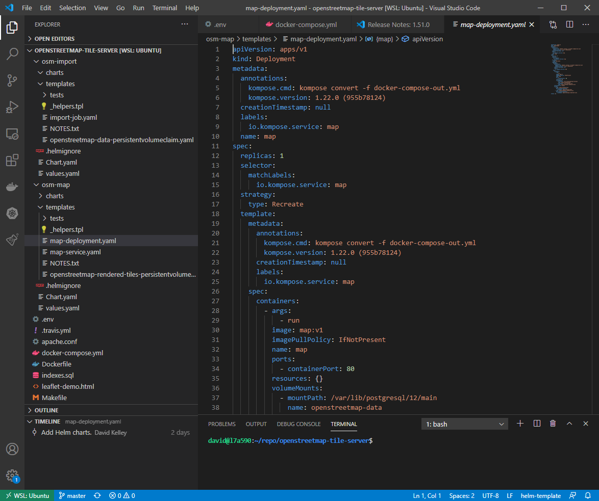

You're deploying a service. It is intended to run indefinitely, and absent
our intervention, K8s will see to it that it does just that.

Because you're deploying a service, *map-deployment.yaml* defines the
*apiVersion* to be *apps/v1* and the *kind* to be *Deployment*. Service details
are defined in the *templates/map-service.yaml* file.

Deploy the service by typing **helm install map ./osm-map**. Confirm that the
service is running properly with kubectl and/or the minikube dashboard.

You have to expose the service in order to browse the map. To do this,
type **minikube service --url map**, like below:

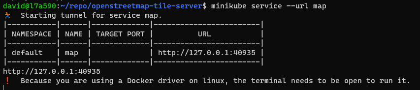

Browse to the reported URL, and you should see this now-familiar map:

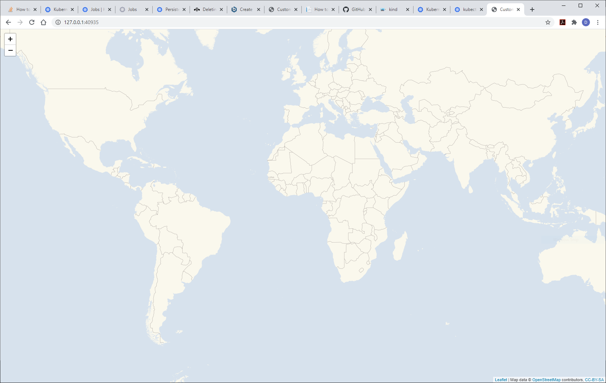

Pat yourself on the back. Your tile server is up and running in K8s.

When you're done browsing your map, you can stop minikube by typing
**minikube stop**, as shown below:

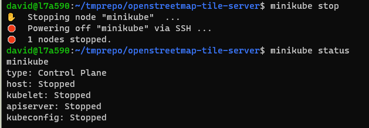

When you want to restart your tile server, fire up minikube and restart the
deployment, as seen below:

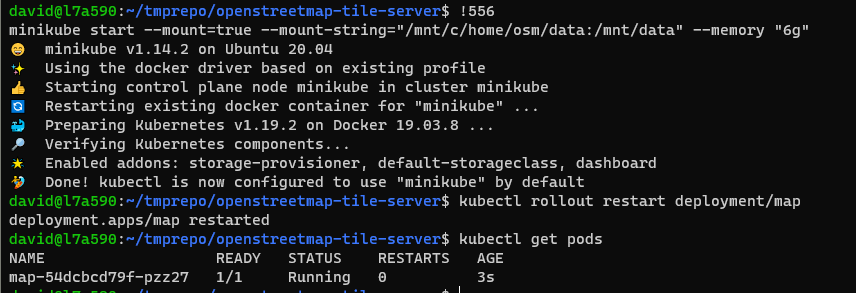

If you wish to delete the import job and/or map deployment, type:

    helm uninstall import
    helm uninstall map
    
# kind

[kind](https://kind.sigs.k8s.io/) is a tool for running local Kubernetes
clusters using Docker container "nodes". kind (**K**ubernetes **In**
**D**ocker) runs on macOS, Linux, and Windows.  I run kind on Ubuntu.

Install kind:

    curl -Lo ./kind https://kind.sigs.k8s.io/dl/v0.9.0/kind-linux-amd64
    chmod +x ./kind
    sudo mv ./kind /usr/local/bin
    
 In order to set up a kind cluster, the first thing to do is to pull the
[""node"" image](https://kind.sigs.k8s.io/docs/design/node-image/). Node image
releases are available at <https://github.com/kubernetes-sigs/kind/releases>.

For example, if you want release v0.9.0, then type
**docker pull kindest/node:v1.19.1@sha256:98cf5288864662e37115e362b23e4369c8c4a408f99cbc06e58ac30ddc721600**.

When the pull completes, you're ready to create a cluster. You need, at a
minimum, to configure the cluster with these settings:

* Mount */mnt/c/home/osm/data* on */mnt/data* in the node container. That
way the import job will see your PBF extract.

* Expose the map service on port 31789. This enables you to browse the map.

I created a file called *kind-config.yaml* for kind configuration, as shown
below:

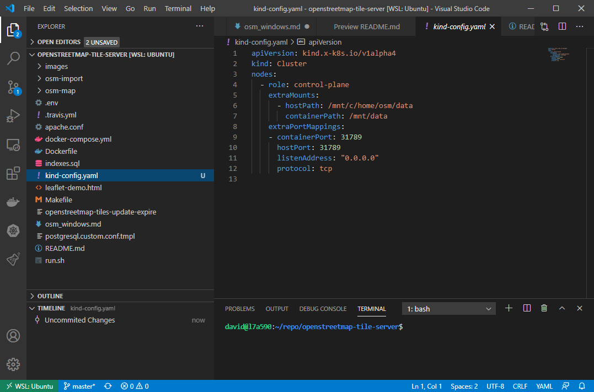

kind has the neat feature that you can define multiple nodes for your cluster.
My *kind-config.yaml* defines a single node: the required control-plane node.
If you like, you can add one or more worker nodes to the configuration.

Create the cluster by typing **kind create cluster --config kind-config.yaml**,
as shown below:

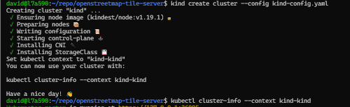

Once the cluster is created, type **kubectl cluster-info --context kind-kind**,
as instructed.

The last step in preparing your cluster is to load image *map:v1* into it. Do
that by typing **kind load docker-image map:v1**, as seen below:

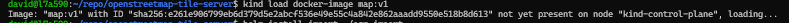

You're all set. Run the import job by typing **helm install import
./osm-import**. When it completes, run the map service by typing **helm
install map ./osm-map**. Browse <http://localhost:31789>, and you should see
the world map.

If you wish to monitor your cluster with a dashboard, see the
instructions at
[Local Kubernetes with kind, Helm & Dashboard](https://medium.com/@munza/local-kubernetes-with-kind-helm-dashboard-41152e4b3b3d), which worked fine for me
with zero modifications.

The proof is in the pudding. Below the dashboard gets installed:

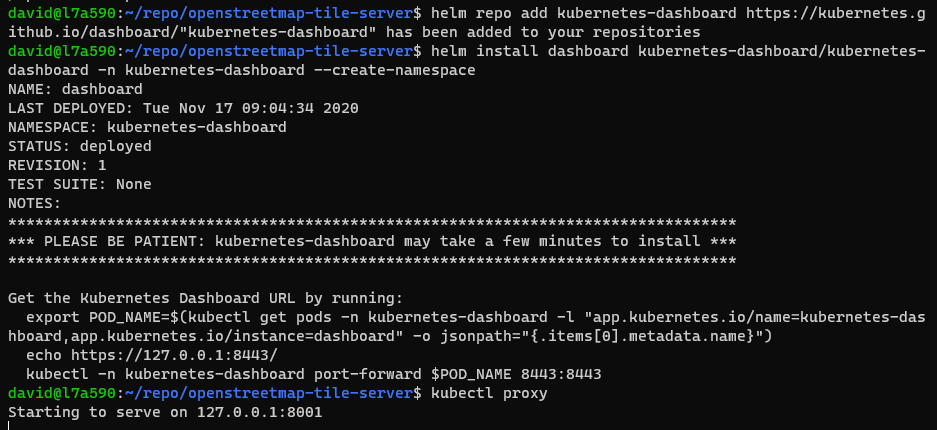

Next we acquire the service account token, as shown here:

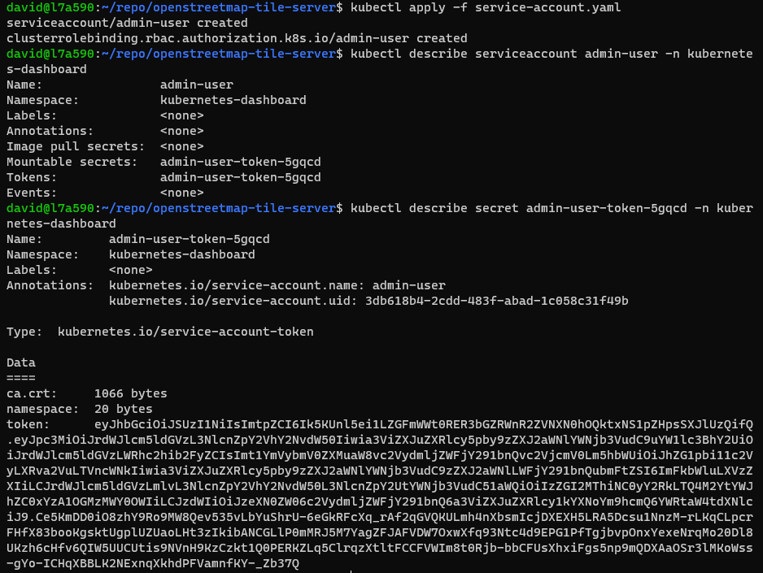

If you're wondering about the definition of *service-account.yaml*, which
is referenced in the screenshot, know that you can view it in the next
section.

Plug the token into the dashboard, and it comes right up:

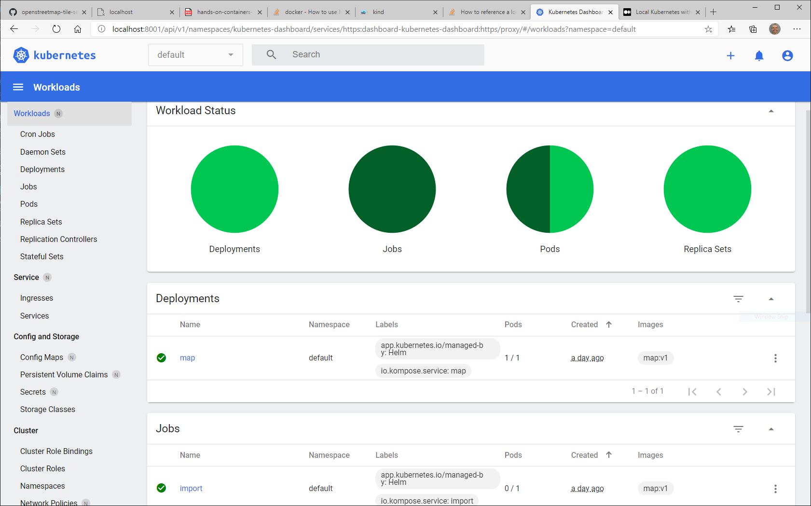

If you want to delete the cluster, type **kind delete cluster**.

# minikube vs. kind

You can find detailed pros and cons evaluations of minikube and kind online.
I won't get into all that. I will say that kind has a definite downside for
mapping, which is that
[you can't stop and (re)start a kind cluster](https://github.com/kubernetes-sigs/kind/issues/479). This is problematic because both the PostgreSQL database and
rendered tiles need to be persisted. You don't want to be constantly
repopulating the database and rerendering the tiles.

minikube has **start** and **stop** commands, which is the behavior you want
for mapping.

# kustomize

[kustomize](https://github.com/kubernetes-sigs/kustomize) lets you customize
raw, template-free YAML files for multiple purposes, leaving the original YAML
untouched and usable as is. kustomize is integrated with kubectl as of
v1.14.

kustomize takes a different approach than Helm. You can find online
comparisons between Helm and kustomize. I won't repeat that discussion here.
I will say that kustomize makes a lot of sense for my application.  I just
happened to encounter Helm first on my journey of discovery.

If you'd like to try kustomize with OSM maps on your cluster, then follow these
steps:

1. Create the PersistentVolumeClaim for the PostgreSQL database: **kubectl apply -f base-import/open\*.yaml**
2. Run the import job: **kubectl apply -k ./base-import**
3. Create the PersistentVolumeClaim for the rendered tiles: **kubectl apply -f base-map/open\*.yaml**
4. Run the map deployment: **kubectl apply -k ./base-map**

# Odds and Ends

Remember when I said that there are at least two ways to monitor K8S? Well,
there's a third way, which is with VSCode, as displayed below:

To get this functionality, install the VSCode [Kubernetes](https://marketplace.visualstudio.com/items?itemName=ms-kubernetes-tools.vscode-kubernetes-tools)
extension.

The whole Docker/WSL/VSCode integration is pretty fantastic, in my opinion.

# To Do

* <strike>Templatize the Helm charts.</strike> Never mind.  Use kustomize
overlays instead.

# See Also

* [Overview of kubectl](https://kubernetes.io/docs/reference/kubectl/overview/)

# Contact

[David Kelley](mailto:David.Kelley@sas.com), SAS

